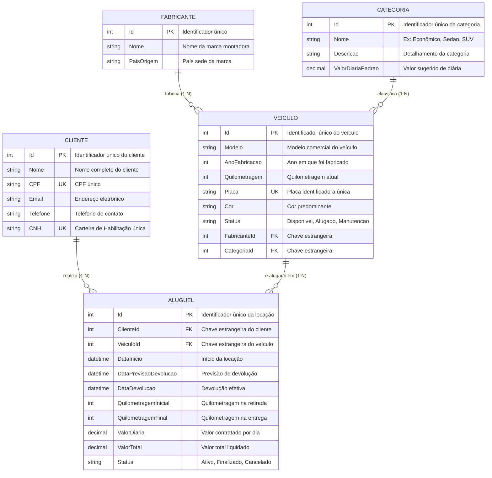

# Documentação Técnica - TP1 (Etapa 1: Modelagem do Banco de Dados)
## Sistema de Aluguel de Veículos

**Disciplina**: Desenvolvimento Backend / Banco de Dados  
**Tecnologias**: C# (.NET 8.0 / C# 6+), Entity Framework Core 8, Microsoft SQL Server Express  
**Foco da Entrega**: **Etapa 1 - Modelagem do Banco de Dados**

---

## 1. Escopo Desta Entrega (Etapa 1)

Conforme as diretrizes do trabalho e a grade de avaliação, esta entrega contempla **os requisitos da Etapa 1**:

- **Etapa 1**:
  1. Modelo Conceitual do Banco de Dados para a locadora de veículos.
  2. Implementação das classes de entidades em C# na camada `Models/`.
  3. Definição explícita de Chaves Primárias (`[Key]`, PKs, Identity).
  4. Definição explícita de Chaves Estrangeiras (`[ForeignKey]`, FKs) e integridade referencial.
  5. Configuração da classe `ApplicationContext` para mapeamento no SQL Server com Entity Framework Core.
  6. Mapeamento de no mínimo 5 entidades (Veículo, Fabricante, Cliente, Aluguel e Categoria).
  7. Migração inicial (`Migrations/`) e script SQL DDL gerados pelo EF Core.

*(Etapas seguintes — **Etapa 2: Implementação do Backend (APIs CRUD e 5 Filtros com Joins)**, **Etapa 3: Testes e Documentação (Swagger UI e Relatório)** e **Etapa 4: Vídeo Apresentação (Pitch)**

---

## 2. Requisitos e Regras de Negócio da Etapa 1

| Item | Requisito do Enunciado | Como foi atendido no Projeto |
|---|---|---|
| **1.1** | *Todo veículo pertence a um fabricante e deve ter registrado seu modelo, ano de fabricação e quilometragem* | Entidade `Veiculo` possui `Modelo`, `AnoFabricacao`, `Quilometragem`, `Placa` (com índice único), `Cor`, `Status` e chave estrangeira obrigatória `FabricanteId` vinculada a `Fabricante`. |
| **1.1** | *O cliente deve ter pelo menos nome, CPF e e-mail* | Entidade `Cliente` possui `Nome`, `CPF` (com índice único), `Email`, além de `Telefone` e `CNH` (com índice único). |
| **1.1** | *Todo aluguel está atrelado a um cliente, um veículo em um dado período de tempo* | Entidade `Aluguel` contém chaves estrangeiras `ClienteId` e `VeiculoId`, `DataInicio` e `DataPrevisaoDevolucao`. |
| **1.1** | *É necessário registrar a devolução do veículo em um aluguel, além da quilometragem inicial e final, valor da diária e valor total da locação* | Entidade `Aluguel` contempla `DataDevolucao` (anulável até a entrega), `QuilometragemInicial`, `QuilometragemFinal`, `ValorDiaria` e `ValorTotal`. |
| **1.2** | *Utilize o Entity Framework para traduzir o modelo conceitual em um esquema relacional* | Criação da classe `ApplicationContext` herdando de `DbContext`, gerando migrações e script DDL compatível com o SQL Server. |
| **1.3** | *Defina as chaves primárias, estrangeiras e outras restrições de integridade* | Todas as tabelas possuem PKs auto-incrementais (`Identity`), FKs com integridade referencial (`Restrict`), índices únicos para Placa, CPF e CNH, e precisão monetária `decimal(18,2)`. |
| **1.4** | *Implemente as classes de entidades em C# que representam as tabelas do banco de dados* | Classes criadas no namespace `LocadoraVeiculos.Models`: `Fabricante`, `Categoria`, `Veiculo`, `Cliente`, `Aluguel`. |
| **1.5** | *O banco deve possuir no mínimo 5 entidades (uma além das citadas no item 1.1)* | Implementação da 5ª entidade: **`Categoria`** (classificação de veículos em grupos como Econômico, Sedan Médio, SUV, Luxo, com valor base de diária). |

---

## 3. Modelo Conceitual do Banco de Dados

O modelo conceitual descreve a estrutura de dados da locadora em alto nível, evidenciando as entidades, atributos principais e seus relacionamentos:

### 3.1 Diagrama Entidade-Relacionamento Conceitual



### 3.2 Cardinalidades e Regras de Negócio
- **Fabricante (1) -> Veículo (N)**: Um fabricante pode ter vários veículos na frota; cada veículo pertence a exatamente um fabricante.
- **Categoria (1) -> Veículo (N)**: Uma categoria categoriza múltiplos veículos; cada veículo tem sua categoria específica.
- **Cliente (1) -> Aluguel (N)**: Um cliente pode locar veículos em vários momentos; cada aluguel é emitido para um cliente específico.
- **Veículo (1) -> Aluguel (N)**: Um veículo pode participar de múltiplos contratos de aluguel ao longo de sua utilização; cada contrato refere-se a um veículo específico.

---

## 4. Modelo Lógico / Relacional

A tradução do modelo conceitual para o modelo relacional gera o seguinte esquema físico de tabelas para o SQL Server:

### Tabela 1: `Fabricantes`
- `Id` (INT, NOT NULL, PK, IDENTITY)
- `Nome` (NVARCHAR(100), NOT NULL)
- `PaisOrigem` (NVARCHAR(50), NULL)

### Tabela 2: `Categorias` *(5ª Entidade)*
- `Id` (INT, NOT NULL, PK, IDENTITY)
- `Nome` (NVARCHAR(50), NOT NULL)
- `Descricao` (NVARCHAR(250), NULL)
- `ValorDiariaPadrao` (DECIMAL(18,2), NOT NULL)

### Tabela 3: `Veiculos`
- `Id` (INT, NOT NULL, PK, IDENTITY)
- `Modelo` (NVARCHAR(100), NOT NULL)
- `AnoFabricacao` (INT, NOT NULL)
- `Quilometragem` (INT, NOT NULL)
- `Placa` (NVARCHAR(10), NOT NULL, UNIQUE)
- `Cor` (NVARCHAR(30), NOT NULL)
- `Status` (NVARCHAR(20), NOT NULL, DEFAULT 'Disponivel')
- `FabricanteId` (INT, NOT NULL, FK -> Fabricantes.Id, ON DELETE NO ACTION)
- `CategoriaId` (INT, NOT NULL, FK -> Categorias.Id, ON DELETE NO ACTION)

### Tabela 4: `Clientes`
- `Id` (INT, NOT NULL, PK, IDENTITY)
- `Nome` (NVARCHAR(150), NOT NULL)
- `CPF` (NVARCHAR(14), NOT NULL, UNIQUE)
- `Email` (NVARCHAR(150), NOT NULL)
- `Telefone` (NVARCHAR(20), NULL)
- `CNH` (NVARCHAR(20), NULL, UNIQUE com filtro `[CNH] IS NOT NULL`)

### Tabela 5: `Alugueis`
- `Id` (INT, NOT NULL, PK, IDENTITY)
- `ClienteId` (INT, NOT NULL, FK -> Clientes.Id, ON DELETE NO ACTION)
- `VeiculoId` (INT, NOT NULL, FK -> Veiculos.Id, ON DELETE NO ACTION)
- `DataInicio` (DATETIME2, NOT NULL)
- `DataPrevisaoDevolucao` (DATETIME2, NOT NULL)
- `DataDevolucao` (DATETIME2, NULL)
- `QuilometragemInicial` (INT, NOT NULL)
- `QuilometragemFinal` (INT, NULL)
- `ValorDiaria` (DECIMAL(18,2), NOT NULL)
- `ValorTotal` (DECIMAL(18,2), NULL)
- `Status` (NVARCHAR(20), NOT NULL, DEFAULT 'Ativo')

---

## 5. Implementação no Entity Framework Core

### 5.1 Definição de Chaves Primárias
Todas as entidades possuem chave primária configurada tanto por convenção / anotação `[Key]` quanto por **Fluent API** no método `OnModelCreating`:
```csharp
modelBuilder.Entity<Fabricante>().HasKey(f => f.Id);
modelBuilder.Entity<Categoria>().HasKey(c => c.Id);
modelBuilder.Entity<Veiculo>().HasKey(v => v.Id);
modelBuilder.Entity<Cliente>().HasKey(c => c.Id);
modelBuilder.Entity<Aluguel>().HasKey(a => a.Id);
```

### 5.2 Definição de Chaves Estrangeiras e Integridade Referencial
As chaves estrangeiras foram mapeadas por anotação `[ForeignKey]` nas entidades e consolidadas via **Fluent API** com proteção contra deleção em cascata acidental (`DeleteBehavior.Restrict`):
```csharp
// Relacionamento Veiculo -> Fabricante
modelBuilder.Entity<Veiculo>()
    .HasOne(v => v.Fabricante)
    .WithMany(f => f.Veiculos)
    .HasForeignKey(v => v.FabricanteId)
    .OnDelete(DeleteBehavior.Restrict);

// Relacionamento Veiculo -> Categoria
modelBuilder.Entity<Veiculo>()
    .HasOne(v => v.Categoria)
    .WithMany(c => c.Veiculos)
    .HasForeignKey(v => v.CategoriaId)
    .OnDelete(DeleteBehavior.Restrict);

// Relacionamento Aluguel -> Cliente
modelBuilder.Entity<Aluguel>()
    .HasOne(a => a.Cliente)
    .WithMany(c => c.Alugueis)
    .HasForeignKey(a => a.ClienteId)
    .OnDelete(DeleteBehavior.Restrict);

// Relacionamento Aluguel -> Veiculo
modelBuilder.Entity<Aluguel>()
    .HasOne(a => a.Veiculo)
    .WithMany(v => v.Alugueis)
    .HasForeignKey(a => a.VeiculoId)
    .OnDelete(DeleteBehavior.Restrict);
```

### 5.3 Configuração da Classe `ApplicationContext`
A classe **`ApplicationContext`** no namespace `LocadoraVeiculos.Data` atende diretamente ao critério de avaliação da rubrica:
- Estende `Microsoft.EntityFrameworkCore.DbContext`.
- Expõe propriedades `DbSet<T>` para as 5 entidades: `Fabricantes`, `Categorias`, `Veiculos`, `Clientes` e `Alugueis`.
- Possui construtor com injeção de `DbContextOptions<ApplicationContext>`.
- Possui fallback no método `OnConfiguring` apontando para o SQL Server Express (`Server=localhost\\SQLEXPRESS;Database=LocadoraVeiculosDB;...`).
- Implementa `OnModelCreating` com todas as regras de integridade, índices únicos e carga de dados de teste via `HasData`.
- É registrada no container de injeção de dependência em `Program.cs` através de `builder.Services.AddDbContext<ApplicationContext>(...)`.

---

## 6. Como Compilar e Validar a Etapa 1

### Comandos de Validação

1. **Compilação do Projeto**:
   ```powershell
   dotnet build
   ```
   *Resultado esperado: 0 Avisos, 0 Erros.*

2. **Geração do Script SQL DDL**:
   ```powershell
   dotnet ef migrations script -o docs/Script_Criacao_Banco.sql
   ```
   *Gera o arquivo SQL DDL com a criação de tabelas, PKs, FKs, restrições e dados iniciais para o SQL Server.*

3. **Aplicação das Migrações no Banco de Dados (SQL Server Express)**:
   ```powershell
   dotnet ef database update
   ```

4. **Execução do Projeto**:
   ```powershell
   dotnet run
   ```
   Acessando `http://localhost:5221/status-modelagem`, a aplicação responde confirmando que a classe `ApplicationContext` está mapeando com sucesso as 5 tabelas no SQL Server.
